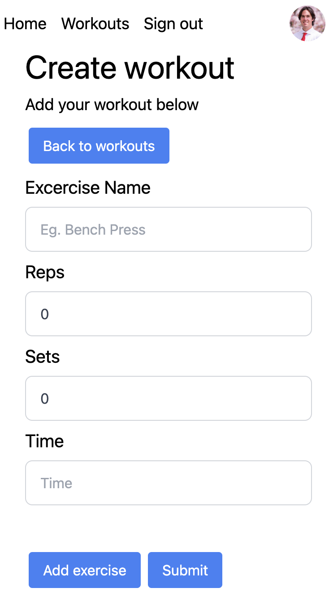

# Workout Tracker

### An application that tracks workouts. This app will track the workout, date, and excercises completed. It will then identify the body parts that have been exercised, recommend healing times, and future workouts.

## Tech used:      

 

# Optimizations:

## Performance optimizations:

 

# Lessons Learned:

 
